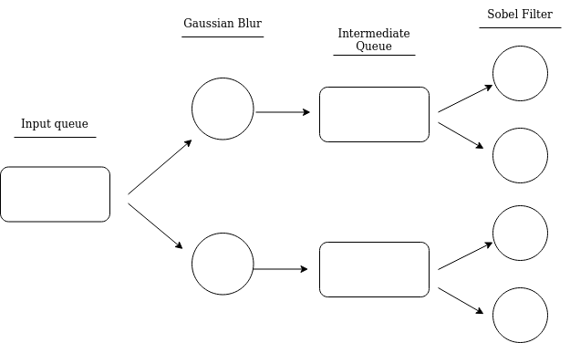
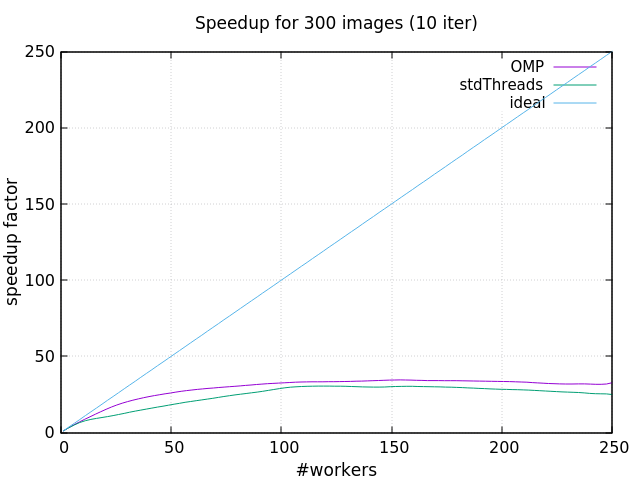

# Simple Image Processor

This is the fourth assignment for the class of [Parallel and Distributed Systems](http://didawiki.di.unipi.it/doku.php/magistraleinformaticanetworking/spm/sdpm09support) @Unipi. I developed two implementations for the problem of applying two openCV filters to a series of images, using different patterns.   
The two applied filters are: **Gaussian Blur** and **Sobel Filter**.  
The two parallel implementations are:
* **Standard C++ Threads** (see file [ImageProcessor.cpp](ImageProcessor.cpp)) and
* **OMP Parallel For** (see file [ImageProcessor.cpp](ImageProcessor.cpp))
  

## Getting Started

To build the project simply clone the repo and build it using the following commands.


### Building
To generate the executable:  
```
g++ -std=c++17 -O3 -I <openCV includes> -L <openCV library> main.cpp -o main -lopencv_core -lopencv_imgproc -lopencv_imgcodecs -fopenmp -pthread
```
in the root of the cloned project.  

e.g.  (if you are running it from the xeon-phi machine @Unipi)
```
g++ -std=c++17 -O3 -I /home/marcod/opencv4/include/opencv4 -L /home/marcod/opencv4/lib main.cpp -o main -lopencv_core -lopencv_imgproc -lopencv_imgcodecs -fopenmp -pthread
```

No makefile this time, due to some problems with linking the openCV library.


### Running
The executable can be found in the root directory of the project. Just run it with:

```./main <input_folder> <n_iterations> <nWorkers>``` 


## Choices
Prior the creation of the present parallel implementations, I developed a small benchmark to understand the weight of each filter application to a single image (in a sequential version of course). We can call this implementation **two-stages sequential pipeline**. You can find the code in the [ImageProcessor](ImageProcessor.cpp) class inside *sequentialProcessing()*.  
It turned out that the Sobel filter is much heavier than the Gaussian Blur. Following are the results obtained:  
* Gaussian Blur: ~4.5 ms/img
* Sobel Filter: ~110 ms/img

A good solution would have been to realise a two-stages pipeline with a farm at each stage, each with a number of workers proportional to the weight of the filter. A greater number of workers for the Sobel farm with respect to the workers of the Gaussian Blur farm would have helped absorbing the discrepancy between the two filters.



However, since it was not possible to use implement a solution using the FastFlow library, I decided to code a different solution: a set of threads (cardinality determined by the **nWorkers** CL argument) to which is given a portion of the images. Every thread applies the two filters to the given subset of images and terminates its execution. The *main* function waits for the termination of each spawned thread and returns. This implementation is coded in the *parallelThreads* method, inside the class [ImageProcessor](ImageProcessor.cpp).

The second solution applies the OpenMP parallel for to a simple sequential version. You can find the code in the *parallelOmp* method inside the class [ImageProcessor](ImageProcessor.cpp).

## Results
The experience results are summarized in some plots that express the scalability and the speedup obtained running the code on the Xeon-phi machine.  
The benchmark depicts the scenario of **applying the two filters** to 300 images. 

For the scenario I computed the execution time considering 1 up to 250 threads. Following are illustrated the plots with the metrics described. 




## Plotting

To obtain the data used in the results shown you have to build the project in two different ways: the first by leaving in ```main.cpp```  just the execution of the parallelOMP version and the second by executing only the parallelThreads version. Refer to [main.cpp](https://github.com/dbarasti/SimpleImageProcessor/blob/master/main.cpp) to understand what this means in practice.  
The two executables obtained must be put in a folder called ```builds/``` in order for the ```benchmark.sh``` script to work properly. These two executable should be called respectively ```img_processing_OMP``` and ```img_processing_stdThreads```.  

*To change the namings just edit the variables in *```benchmark.sh```.

Running the script with ```./benchmark.sh``` will generate the data for plotting in the folder ```plotting-and-data/data/```. To obtain the plots just open [Gnuplot](http://www.gnuplot.info/) in the folder ```plotting-and-data/``` and load the scripts with

```load "<script-name.gp>"```
 
    
## Acknowledgments
This project was developed for an assignment of the course [Parallel and Distributed Systems](http://didawiki.di.unipi.it/doku.php/magistraleinformaticanetworking/spm/sdpm09support) at University of Pisa under the guide of [Prof. Marco Danelutto](http://calvados.di.unipi.it/paragroup/danelutto/) and [Prof. Massimo Torquati](http://calvados.di.unipi.it/paragroup/torquati/).

